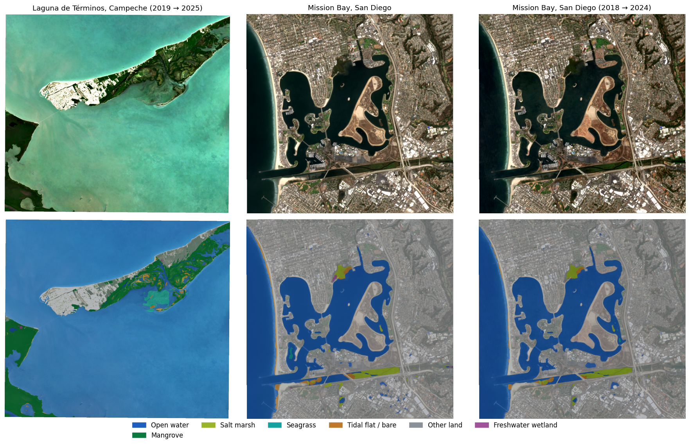

# BlueCarbon-AI

**Mapping the coastal ecosystems that store carbon (mangroves, salt marshes and seagrass meadows) from
satellite imagery with machine learning, and estimating how much carbon they hold.**

[**Website →**](https://yanicksanchez14-creator.github.io/bluecarbon-ai/) &nbsp; [**Live analysis tool →**](https://bluecarbon-ai.streamlit.app)

[](https://github.com/yanicksanchez14-creator/bluecarbon-ai/actions/workflows/ci.yml)




## The problem

Coastal wetlands ("blue carbon" ecosystems) capture carbon up to several times faster per hectare than
land forests and keep it locked in their soils for centuries. They are also disappearing, and
conservation groups, governments and carbon-credit projects need to know **where they are, how large
they are, and how much carbon is at stake**. Mapping them by hand from imagery is slow and doesn't
scale.

## What BlueCarbon-AI does

1. **Pulls free satellite imagery.** It builds a cloud-free Sentinel-2 composite for any coastline and
   season through Google Earth Engine.
2. **Maps habitats automatically.** A trained model labels every 10 × 10 m pixel as open water,
   mangrove, salt marsh, seagrass, tidal flat or other land.
3. **Estimates carbon with honest uncertainty.** Habitat areas are corrected for the model's known
   error rates, then converted to stored carbon and yearly uptake using IPCC reference values, reported
   as a likely range rather than a single number.
4. **Serves it in a web app.** Anyone can explore mapped sites, switch between satellite, false-color and
   habitat views, and read a plain-language summary of the results.

## Highlights

- **End-to-end geospatial ML pipeline.** Earth Engine ingestion, Cloud Score+ cloud masking, seasonal
  median composites, and tiled download of any area size in the correct map projection. One CLI and one
  YAML config drive every stage.
- **Trained on published scientific maps.** Reference labels are fused from ESA WorldCover, the GWL_FCS30
  global wetland map, the Murray et al. global tidal-flat maps and the Allen Coral Atlas across **44 coastal
  sites on six continents**.
- **Evaluation designed not to cheat.** Training tiles never overlap, whole 5 km blocks go to one data
  split, and entire estuaries are held out, so scores reflect performance on coastlines the model has
  never seen.
- **Two model families, the best one wins.** A gradient-boosted (LightGBM) spectral model with
  water-column features, and a U-Net deep neural network (ResNet-34 encoder). The pipeline trains both
  and keeps whichever maps blue carbon habitats more accurately.
- **Carbon from real soil measurements.** Soil carbon comes from 2,515 measured soil cores (133 studies, 31 countries) in the
  Smithsonian Coastal Carbon Library: each site uses the cores of each habitat within 100–300 km, and falls back
  to IPCC Tier 1 values only where none exist. Total-carbon measurements that count limestone carbonate are
  filtered out. Areas are bias-corrected (Olofsson et al., 2014) and carbon is estimated with 5,000-draw Monte
  Carlo sampling.
- **Production engineering.** Installable Python package, typed configuration, self-describing model
  files, an automated test suite that runs the full pipeline offline, and GitHub Actions CI.

<!-- results:start -->
## Results

The model was trained on 39 coastal sites on six continents (2021 imagery, plus 2020 and 2022 images of the
same sites) and scored on areas it **never saw during training**: held-out 5 km blocks from every site, plus
five entire estuaries (Mission Bay, Plum Island, Moreton Bay, Shoalwater Bay and Tampa Bay). The
deep-learning model (U-Net, ResNet-34 encoder) beat the gradient-boosted alternative and is the one deployed.

| Habitat | IoU | F1 | What it means |
|---|---:|---:|---|
| **Mangrove** ◆ | **0.94** | **0.97** | Reliable, including on unseen estuaries (Tampa Bay 0.91, Shoalwater Bay 0.86, Moreton Bay 0.86) |
| **Salt marsh** ◆ | **0.82** | **0.90** | Strong on large marshes (unseen Plum Island 0.91); weak where marsh is a thin fringe (unseen Mission Bay 0.58) |
| **Seagrass** ◆ | **0.38** | **0.55** | Improving: unseen Tampa Bay 0.62 (was not reported per site before), and now detected in Moreton Bay (0.12) where the previous model found almost none. Still misses most meadows in murky or deep water |
| Open water | 0.84 | 0.91 | Reliable |
| Other land | 0.93 | 0.97 | Reliable |
| Tidal flat | 0.72 | 0.84 | Fair |
| Freshwater wetland | 0.60 | 0.75 | Separates inland marsh from tidal salt marsh |
| **Mean (7 classes)** | **0.75** | **0.84** | |

◆ = blue carbon habitat. IoU (intersection over union) measures how well the predicted map overlaps
the reference map, where 1.0 is a perfect match. Overall pixel accuracy (90%) is reported but isn't the
headline number, because open water dominates it. Scores use the current reference labels (more seagrass
survey maps and stricter salt marsh than before), so they are harder to earn than the previous model's.

**How it got here.** The first model scored mangrove 0.90, salt marsh 0.35 and seagrass 0.00. Since then:
salt marsh labels from a dedicated wetland map; seagrass labels from the Allen Coral Atlas plus official
survey maps (Florida FWC; Seamap Australia for Moreton Bay, the Great Barrier Reef, Western Australia and
Victoria), with open-water examples next to every surveyed meadow; a clear-water image that lets the seafloor
show through; elevation and tide as inputs; extra years of imagery; and per-estuary checks, which caught an
earlier model using latitude as a shortcut.

**Next:** Sentinel-1 radar input, a seagrass specialist model, habitat history back to 1985, and field checks
against dive surveys.


The website maps 44 sites, plus 2018 → 2024 (Mission Bay) and 2019 → 2025 (Laguna de Términos) change studies.
<!-- results:end -->

## How it works

```
Sentinel-2 imagery ──► cloud masking + seasonal composite ──► 10 bands + 9 spectral indices
                                                                        │
ESA WorldCover · tidal-flat maps · Allen Coral Atlas ──► fused labels ──┤
                                                                        ▼
                                             LightGBM spectral model  /  U-Net  (best one kept)
                                                                        │
                                   habitat map ──► error-corrected areas ──► carbon stored & absorbed per year
```

The full write-up, with data sources, model details, the carbon method and limitations, is in
[`docs/METHODOLOGY.md`](docs/METHODOLOGY.md).

## Tech stack

**Python** · PyTorch · segmentation-models-pytorch · LightGBM · Google Earth Engine API · Rasterio / GDAL ·
NumPy / SciPy · Streamlit · Folium / Leaflet · Pydantic · Typer · pytest · GitHub Actions

## Run it locally

```bash
git clone https://github.com/yanicksanchez14-creator/bluecarbon-ai.git && cd bluecarbon-ai
pip install -e ".[gee,app,dev]"

streamlit run app/streamlit_app.py      # the web app, using the bundled demo sites
pytest -q                               # offline end-to-end tests
```

The full pipeline (download, label, train, map) runs with `bluecarbon fetch`, `chips`, `train` and `scene`.
It needs a Google Earth Engine project, and there's a ready-made GPU notebook in
[`notebooks/train_colab.ipynb`](notebooks/train_colab.ipynb).

## Project structure

```
src/bluecarbon/
  gee.py         Earth Engine imagery, fused reference labels, tiled download
  features.py    spectral bands and indices, normalization
  spectral.py    LightGBM spectral-context model
  model.py       U-Net models and checkpoints
  train.py       deep-learning training loop
  predict.py     whole-scene inference
  tiling.py      leakage-free spatial train / validation / test split
  metrics.py     accuracy metrics and error-corrected area estimation
  carbon.py      carbon stock and sequestration with Monte Carlo uncertainty
  cli.py         `bluecarbon` command-line tool
app/             Streamlit web app
configs/         pipeline settings and the 44 study sites
tests/           automated tests
docs/            methodology and figures
```

## Limitations

Carbon figures use measured soil cores near each site where available (IPCC global averages elsewhere) and are suited to screening and prioritizing sites,
not to issuing carbon credits, which requires field measurements. Seagrass is the hardest habitat to see
from space because it grows underwater, and tides change what is visible in intertidal areas.

## Data credits

Sentinel-2 (ESA Copernicus) · Cloud Score+ (Google) · ESA WorldCover 2021 · GWL_FCS30 (Zhang et al.)
· Murray et al. global tidal flats · FWC Florida seagrass · Seamap Australia (Moreton Bay seagrass) · Allen Coral Atlas · NASADEM · Smithsonian Coastal Carbon Library (soil cores) · IPCC 2013 Wetlands Supplement.

---

**Yanick Sanchez** · Independent project, 2025–2026 · [MIT License](LICENSE)
